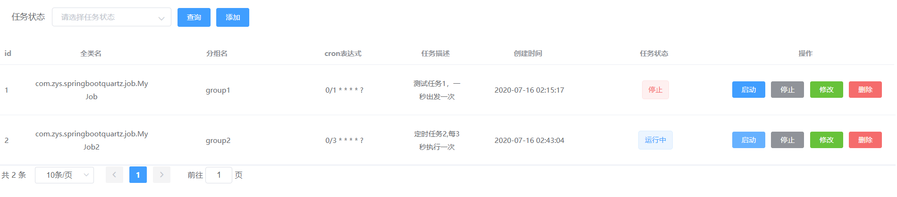
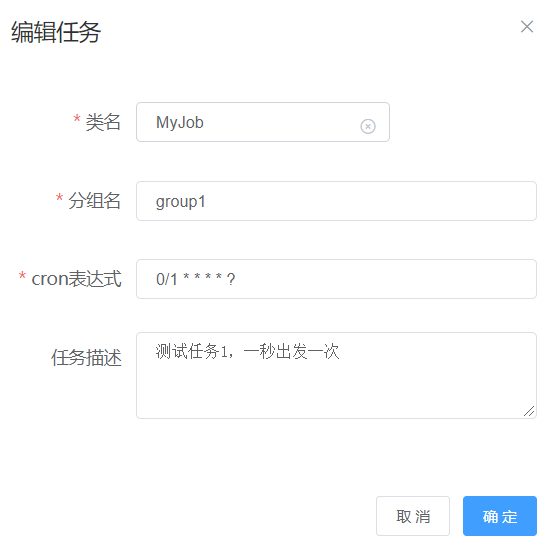

# quartz-mange
springboot集成quartz做动态的定时任务

## 项目结构
mysql目录：mysql创建表的执行脚本
spring-boot-quartz是后台服务
quartz-view是使用vue编写的页面

## 执行方式
1.把整个项目下载后，先创建数据库并执行sql脚本  
2.后台的数据库用户名、密码及数据库名根据实际情况修改  
3.前台先执行npm i，然后执行npm run serve即可  

## 项目截图
首页  

编辑  

